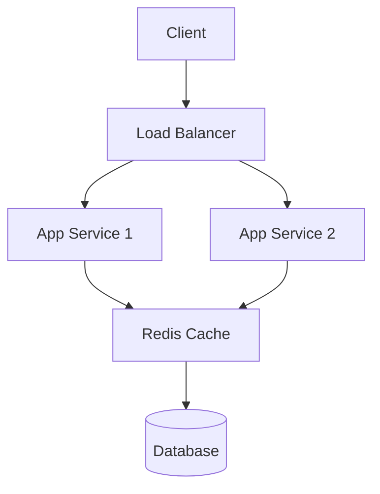
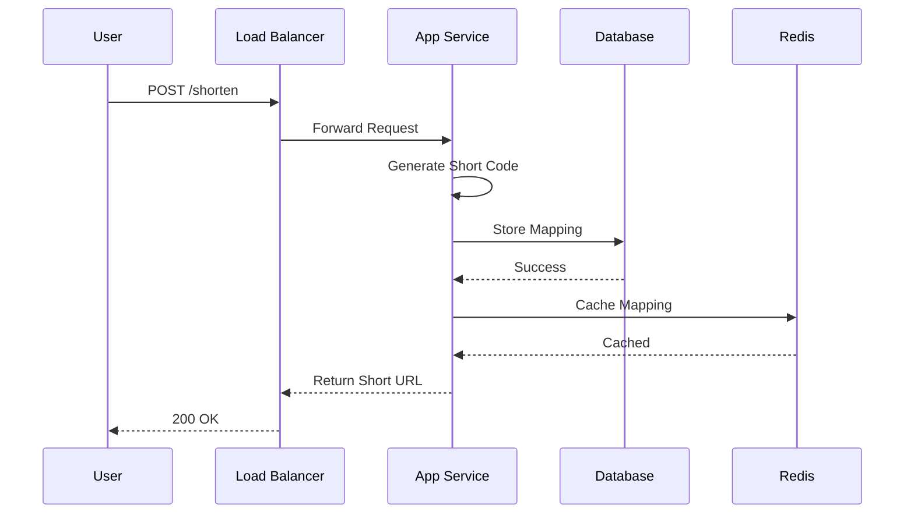
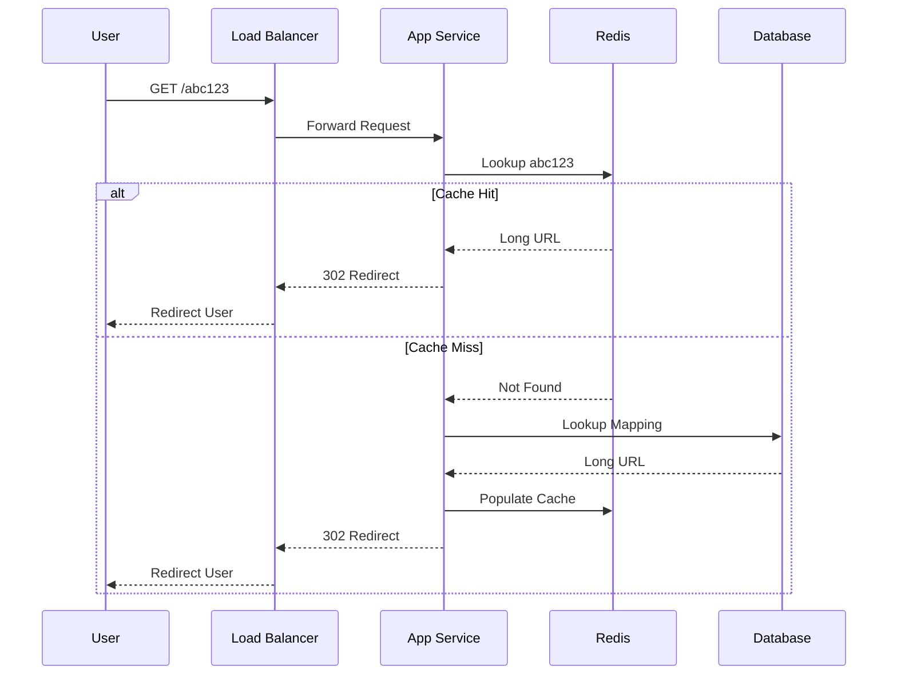

# System Design Interview steps:

## 1. Discuss the Functional requirements
 > Functional requirements describe what the system should do from the user's perspective. They define the features, behaviors, and capabilities of the system.

**Questions to Ask**
1. Who are the users?
2. What actions can users perform?
3. What business problems are we solving?
4. What are the major use cases?

**Example: Design a URL Shortener**

Functional Requirements
1. User can submit a long URL.
2. System generates a short URL.
3. Users can access the original URL using the short URL.
4. Track click analytics.

## 2. Discuss Non-functional requirements
> Non-functional requirements define how well the system should perform. They cover quality attributes.

**Common Areas**
1. Requirement	Description
2. Scalability	Handle growing traffic
3. Availability	System remains operational
4. Reliability	Data consistency and correctness
5. Latency	Response time
6. Durability	Data is not lost
7. Security	Authentication and protection
8. Fault Tolerance	Survive failures

Example: URL Shortener
| Requirement     | Description                      |
| --------------- | -------------------------------- |
| Scalability     | Handle growing traffic           |
| Availability    | System remains operational       |
| Reliability     | Data consistency and correctness |
| Latency         | Response time                    |
| Durability      | Data is not lost                 |
| Security        | Authentication and protection    |
| Fault Tolerance | Survive failures                 |

## 3. Core Entities
> Core entities are the primary business objects stored in the system.

**URL Entity**
```JSON
{
  "id": "123",
  "shortCode": "abc123",
  "longUrl": "https://google.com",
  "createdAt": "2025-01-01",
  "userId": "456"
}
```

**User Entity**
```JSON
{
  "userId": "456",
  "name": "John",
  "email": "john@gmail.com"
}
```

**How to Think About Entities**

For any system:

**Food Delivery**
1. User
2. Restaurant
3. Menu
4. Order
5. Driver
6. Payment

**Instagram**
1. User
2. Post
3. Comment
4. Like
5. Story
6. Follow

**Uber**
Passenger
Driver
Trip
Vehicle
Payment

## 4. API Routes
- Explain what and how with examples

## 5. HLD/Blueprint using diagrams (System architecture, Data Flow & Storage, and Communication.)

> This is the most important section.

1. System Architecture
2. Data Flow
3. Storage
4. Communication
5. Scaling

### System Architecture



### Data Flow (WRITE)



**Flow Explanation**

User
  ↓
Create URL Request
  ↓
Load Balancer
  ↓
Application Service
  ↓
Generate Short Code
  ↓
Store in Database
  ↓
Update Redis Cache
  ↓
Return Short URL

### Data Flow (READ)



**Flow Explanation**

### Storage Design

User
  ↓
Short URL Request
  ↓
Load Balancer
  ↓
Application Service
  ↓
Redis Cache

    Cache Hit
        ↓
    Redirect User

    Cache Miss
        ↓
    Database Lookup
        ↓
    Update Cache
        ↓
    Redirect User

URL_MAPPING
-----------
id
short_code
long_url
created_at
user_id

**Suitable for:**

1. Strong consistency
2. ACID transactions

**NoSQL Alternative**

```JSON
{
  "shortCode": "abc123",
  "longUrl": "https://google.com"
}
```

### Scaling Considerations
**Horizontal Scaling**

1. App Server 1
2. App Server 2
3. App Server 3
4. App Server 4

**Database Scaling**

          Primary DB
          /       \
         /         \
    Replica 1      Replica 2

**Sharding**

1. A-F  → Shard 1
2. G-M  → Shard 2
3. N-Z  → Shard 3

**Interview Flow**

1. Clarify Requirements
        ↓
2. Estimate Scale
        ↓
3. Functional Requirements
        ↓
4. Non-Functional Requirements
        ↓
5. Core Entities
        ↓
6. API Design
        ↓
7. High-Level Architecture
        ↓
8. Database Design
        ↓
9. Scaling Strategy
        ↓
10. Bottlenecks & Tradeoffs
